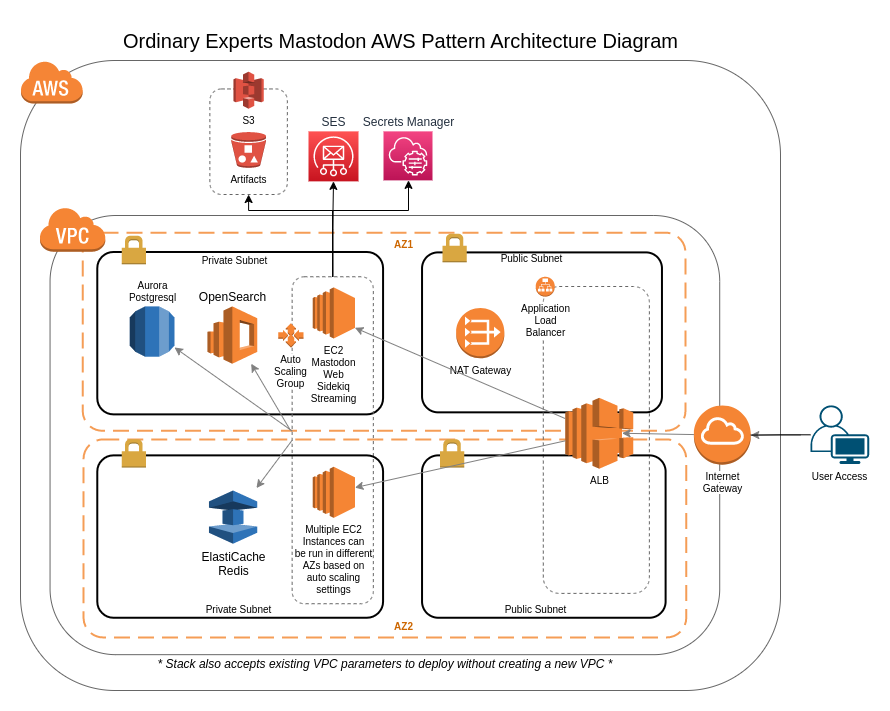

# Mastodon on AWS

## Overview

The Ordinary Experts Mastodon AWS Marketplace product is a CloudFormation template with a custom AMI which provisions a production-ready [Mastodon](https://joinmastodon.org/) system. It uses the following AWS services:

* VPC (operator can pass in VPC info or product can create a VPC)
* EC2 - it provisions an Auto Scaling Group for the web application tier
* Aurora Postgres - for persistent database
* ElastiCache Redis - for cache
* OpenSearch Service - for site search
* S3 - to store user-generated binary files (images, etc)
* SES - for sending email
* Route53 - for setting up friendly domain names
* ACM - for SSL
* and others...(IAM, Secrets Manager, SSM)

## Architecture Diagram

## How to deploy

### Pre-work

Before deploying the pattern, you will need the following provisioned in the AWS account you are going to use:

* A hosted zone set up in Route53
* A SSL certificate set up in Amazon Certificate Manager

### Deploying

To deploy, subscribe to the product and then launch the provided CloudFormation template.

### Post-deploy setup

After an initial deployment, you can create an initial user using the web interface, and then make that user an admin user following these instructions:

https://docs.joinmastodon.org/admin/setup/#admin

You should also fill in the server information as described here:

https://docs.joinmastodon.org/admin/setup/#info

You can connect to the EC2 instance via the Sessions Manager in the AWS console.
